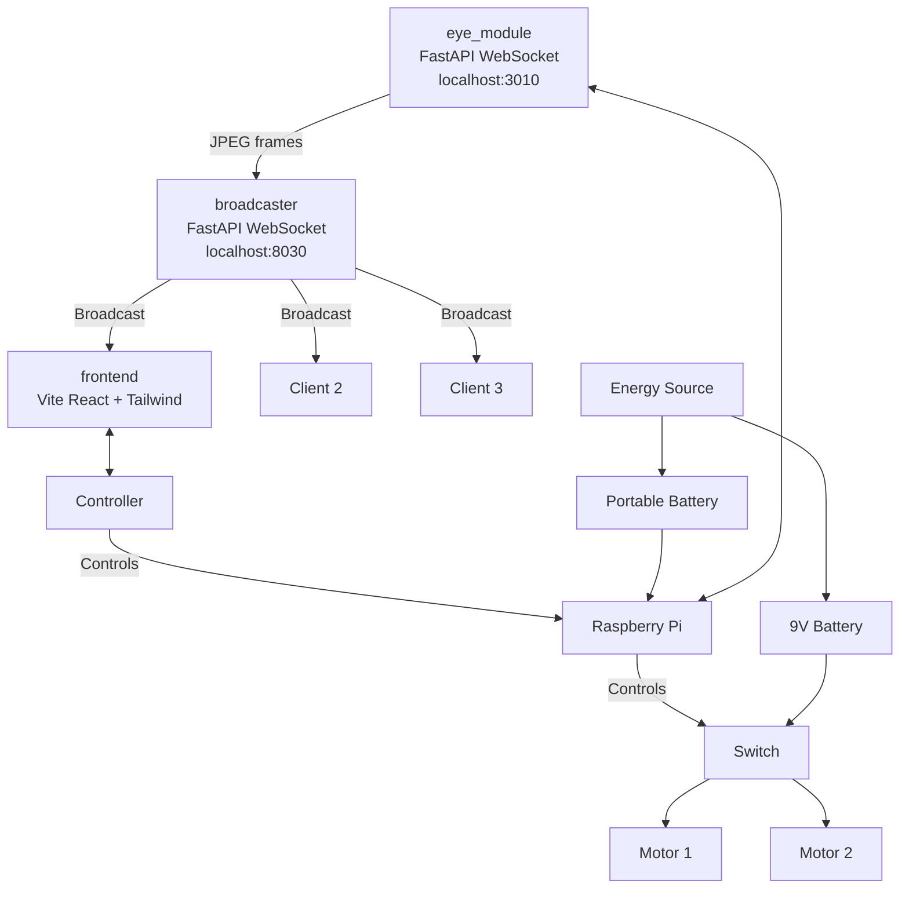

# Surveillence-Robot



## Workspace Layout

- [eye_module/](eye_module/) - single-client Python websocket server that captures a camera frame on each ping and returns JPEG bytes.
- [broadcaster/](broadcaster/) - FastAPI websocket relay that connects to the eye module, copies each image, and broadcasts it to every connected frontend client.
- [frontend/](frontend/) - Vite + React + Tailwind app that connects to the broadcaster and renders the live stream.
- [controller-pi/](controller-pi/) - Python websocket server on port `8020` that relays movement commands to Arduino over serial.
- [controller-uno/](controller-uno/) - Arduino sketch for receiving serial commands and driving motors through L298N.

## Run It

1. Start the eye module:

    ```bash
    cd eye_module
    python -m venv .venv
    . .venv/bin/activate
    pip install -r requirements.txt
    python main.py
    ```

2. Start the broadcaster:

    ```bash
    cd broadcaster
    python -m venv .venv
    . .venv/bin/activate
    pip install -r requirements.txt
    python main.py
    ```

3. Start the frontend:

    ```bash
    cd frontend
    bun install
    bun run dev
    ```

4. Start the controller bridge (Raspberry Pi side):

    ```bash
    cd controller-pi
    python -m venv .venv
    . .venv/bin/activate
    pip install -r requirements.txt
    python main.py
    ```

The frontend was scaffolded in the same shape as a Bun/Vite app and connects to `ws://localhost:8030/ws`, which in turn keeps requesting frames from `ws://localhost:3010/ws`.

The movement controls in frontend connect to `ws://localhost:8020` and send: `forward`, `back`, `left`, `right`, and `stop`.

## Hardware Wiring (Pi + Arduino + L298N + Motors)

Use Arduino to control motor pins, and Raspberry Pi only for USB serial + power/logical control.

### 1) Raspberry Pi to Arduino

- Connect Arduino to Raspberry Pi with a USB cable.
- The Pi script auto-detects `/dev/ttyUSB*` or `/dev/ttyACM*` and sends newline-separated commands.

### 2) Arduino to L298N (logic/control)

Use the same mapping as [controller-uno/controller_uno.ino](controller-uno/controller_uno.ino):

- Arduino `D5` -> L298N `ENA`
- Arduino `D8` -> L298N `IN1`
- Arduino `D9` -> L298N `IN2`
- Arduino `D10` -> L298N `IN3`
- Arduino `D11` -> L298N `IN4`
- Arduino `D6` -> L298N `ENB`
- Arduino `GND` -> L298N `GND`

### 3) Motor wiring

- Left motor leads -> L298N `OUT1` and `OUT2`
- Right motor leads -> L298N `OUT3` and `OUT4`

If forward/back are reversed, swap either motor leads on that channel.

### 4) Power wiring (important)

- Battery positive (motor supply, for example 7.4V or 12V as needed) -> L298N `+12V` (or `VIN` label depending on board)
- Battery negative -> L298N `GND`
- Arduino can be powered from Pi USB (recommended for development)
- Keep all grounds common: Arduino `GND`, L298N `GND`, battery negative must be connected together.

Do not power DC motors directly from Arduino 5V pin.

### 5) Full control path

1. Frontend button press sends websocket command to `ws://localhost:8020`.
2. `controller-pi/main.py` forwards command over USB serial to Arduino.
3. Arduino sketch decodes command and sets L298N direction pins.
4. L298N drives motors accordingly.
5. Frontend button release sends `stop`, Arduino stops both motors.