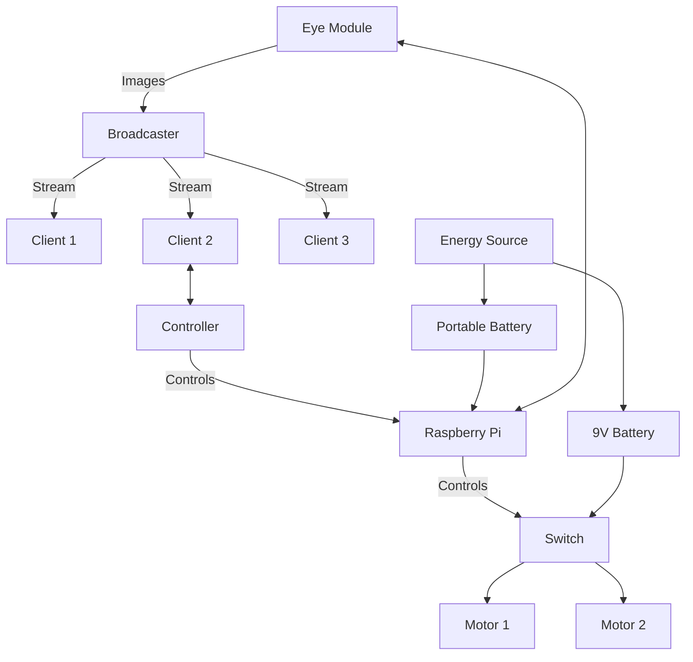

# Surveillence-Robot

```mermaid
flowchart TD
    EM[Eye Module] -->|Images| B[Broadcaster]
    B -->|Stream| C1[Client 1]
    B -->|Stream| C2[Client 2]
    B -->|Stream| C3[Client 3]

    C2 <--> CTRL[Controller]
    CTRL -->|Controls| RPI[Raspberry Pi]
    RPI <--> EM
    RPI -->|Controls| SW[Switch]

    ES[Energy Source] --> PB[Portable Battery]
    ES --> BAT[9V Battery]
    PB --> RPI
    BAT --> SW
    SW --> M1[Motor 1]
    SW --> M2[Motor 2]
```