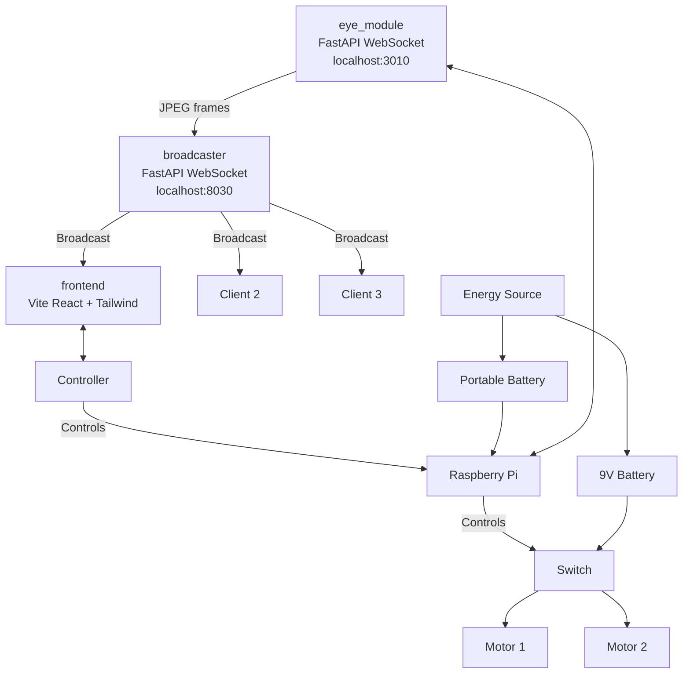

# Surveillence-Robot



## Workspace Layout

- [eye_module/](eye_module/) - single-client Python websocket server that captures a camera frame on each ping and returns JPEG bytes.
- [broadcaster/](broadcaster/) - FastAPI websocket relay that connects to the eye module, copies each image, and broadcasts it to every connected frontend client.
- [frontend/](frontend/) - Vite + React + Tailwind app that connects to the broadcaster and renders the live stream.

## Run It

1. Start the eye module:

    ```bash
    cd eye_module
    python -m venv .venv
    . .venv/bin/activate
    pip install -r requirements.txt
    python main.py
    ```

2. Start the broadcaster:

    ```bash
    cd broadcaster
    python -m venv .venv
    . .venv/bin/activate
    pip install -r requirements.txt
    python main.py
    ```

3. Start the frontend:

    ```bash
    cd frontend
    bun install
    bun run dev
    ```

The frontend was scaffolded in the same shape as a Bun/Vite app and connects to `ws://localhost:8030/ws`, which in turn keeps requesting frames from `ws://localhost:3010/ws`.